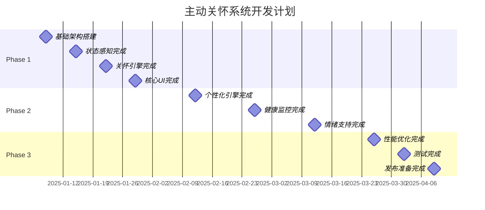

# 实施任务计划：AI Desktop Pet 主动关怀系统强化

## 文档信息
- **版本**: v1.0
- **创建日期**: 2025-01-01
- **关联文档**: requirements.md v2.0, design.md v1.0
- **预计工期**: 14周 (3个阶段)
- **团队规模**: 2-3人 (前端+后端+测试)

---

## 一、项目概览

### 1.1 开发阶段划分

```
Phase 1: 基础感知与关怀引擎 (4周)
├── 状态感知服务开发
├── 基础关怀机会检测
├── 简单个性化机制
└── 核心UI组件

Phase 2: 智能化与个性化 (6周)  
├── 机器学习模型集成
├── 深度个性化引擎
├── 高级健康监控
├── 情绪支持系统
└── 效果评估机制

Phase 3: 优化与完善 (4周)
├── 性能优化
├── 用户体验优化
├── 测试与修复
└── 文档与部署
```

### 1.2 技术栈与工具

| 类别 | 技术/工具 | 用途 |
|------|-----------|------|
| 前端 | React 19 + TypeScript | UI组件开发 |
| 状态管理 | Zustand | 状态管理 |
| 桌面端 | Tauri 2.0 | 系统API调用 |
| 数据库 | SQLite | 数据持久化 |
| 机器学习 | TensorFlow.js | 用户行为预测 |
| 测试 | Vitest + Testing Library | 单元测试 |
| 构建 | Vite | 构建工具 |

---

## 二、Phase 1: 基础感知与关怀引擎 (4周)

### Week 1: 项目基础设施

#### Task 1.1: 项目结构搭建 (2天)
**负责人**: 前端开发  
**优先级**: P0

**具体任务**:
- [ ] 创建新的服务目录结构
  ```
  src/services/proactive-care/
  ├── state-perception/
  ├── care-engine/
  ├── personalization/
  ├── health-monitor/
  ├── emotional-support/
  └── types.ts
  ```
- [ ] 设置TypeScript类型定义
- [ ] 配置ESLint和Prettier规则
- [ ] 创建基础的测试配置

**验收标准**:
- 目录结构符合设计文档
- TypeScript编译无错误
- 测试环境可正常运行

#### Task 1.2: 数据库模式设计 (2天)
**负责人**: 后端开发  
**优先级**: P0

**具体任务**:
- [ ] 创建数据库迁移脚本
- [ ] 实现用户画像表结构
- [ ] 实现关怀历史表结构
- [ ] 实现状态快照表结构
- [ ] 创建数据库索引优化

**验收标准**:
- 数据库表创建成功
- 索引性能测试通过
- 数据迁移脚本可重复执行

#### Task 1.3: 基础Store扩展 (1天)
**负责人**: 前端开发  
**优先级**: P0

**具体任务**:
- [ ] 扩展现有CareStore
- [ ] 创建ProactiveCareStore
- [ ] 创建UserProfileStore
- [ ] 实现Store之间的数据同步

**验收标准**:
- Store类型定义完整
- 数据流测试通过
- 与现有系统兼容

### Week 2: 状态感知服务

#### Task 2.1: 系统活动监控 (3天)
**负责人**: 后端开发  
**优先级**: P0

**具体任务**:
- [ ] 实现Tauri系统API调用
  - 键盘输入频率监控
  - 鼠标活动监控
  - 窗口切换监控
  - 应用使用时间统计
- [ ] 创建活动数据收集服务
- [ ] 实现数据防抖和节流机制
- [ ] 添加权限请求处理

**验收标准**:
- 系统活动数据准确收集
- 性能影响小于5% CPU
- 权限请求用户友好

#### Task 2.2: 工作状态检测 (2天)
**负责人**: 前端开发  
**优先级**: P0

**具体任务**:
- [ ] 实现StatePerceptionService类
- [ ] 集成现有BehaviorAnalyzer
- [ ] 实现工作状态算法
  - 专注状态检测
  - 压力水平计算
  - 疲劳程度评估
- [ ] 创建状态缓存机制

**验收标准**:
- 工作状态检测准确率>80%
- 状态更新延迟<5秒
- 缓存命中率>70%

### Week 3: 基础关怀引擎

#### Task 3.1: 关怀机会检测 (3天)
**负责人**: 前端开发  
**优先级**: P0

**具体任务**:
- [ ] 实现ProactiveCareEngine核心类
- [ ] 创建关怀规则引擎
  - 健康提醒规则
  - 休息提醒规则
  - 情绪支持规则
- [ ] 实现优先级排序算法
- [ ] 添加打扰度控制机制

**验收标准**:
- 关怀机会检测准确
- 优先级排序合理
- 打扰控制有效

#### Task 3.2: 关怀消息生成 (2天)
**负责人**: 前端开发  
**优先级**: P1

**具体任务**:
- [ ] 创建关怀消息模板系统
- [ ] 实现动态内容生成
- [ ] 添加多种语调支持
- [ ] 实现消息个性化基础版本

**验收标准**:
- 消息模板丰富多样
- 内容生成速度<2秒
- 个性化效果明显

### Week 4: 核心UI组件

#### Task 4.1: 关怀通知组件 (2天)
**负责人**: 前端开发  
**优先级**: P0

**具体任务**:
- [ ] 创建CareNotificationPanel组件
- [ ] 实现多种通知样式
  - 温和提醒样式
  - 紧急警告样式
  - 庆祝样式
- [ ] 添加用户交互功能
- [ ] 实现动画效果

**验收标准**:
- 组件响应式设计
- 交互体验流畅
- 动画性能良好

#### Task 4.2: 健康仪表板 (2天)
**负责人**: 前端开发  
**优先级**: P1

**具体任务**:
- [ ] 创建HealthDashboard组件
- [ ] 实现健康指标可视化
- [ ] 添加趋势图表
- [ ] 创建健康建议展示

**验收标准**:
- 数据可视化清晰
- 图表性能优良
- 用户体验友好

#### Task 4.3: 基础设置面板 (1天)
**负责人**: 前端开发  
**优先级**: P2

**具体任务**:
- [ ] 创建基础设置界面
- [ ] 实现关怀类型开关
- [ ] 添加频率控制设置
- [ ] 实现安静时间设置

**验收标准**:
- 设置界面直观易用
- 配置实时生效
- 数据持久化正常

---

## 三、Phase 2: 智能化与个性化 (6周)

### Week 5-6: 个性化引擎开发

#### Task 5.1: 用户画像系统 (3天)
**负责人**: 后端开发  
**优先级**: P0

**具体任务**:
- [ ] 实现PersonalizationEngine类
- [ ] 创建用户画像构建算法
- [ ] 实现行为模式识别
- [ ] 添加偏好学习机制

**验收标准**:
- 用户画像准确度>85%
- 学习速度适中
- 隐私保护到位

#### Task 5.2: 机器学习模型集成 (4天)
**负责人**: 后端开发  
**优先级**: P1

**具体任务**:
- [ ] 集成TensorFlow.js
- [ ] 创建用户行为预测模型
- [ ] 实现在线学习机制
- [ ] 添加模型性能监控

**验收标准**:
- 预测准确率>75%
- 模型大小<10MB
- 推理速度<1秒

#### Task 5.3: 个性化策略引擎 (3天)
**负责人**: 前端开发  
**优先级**: P0

**具体任务**:
- [ ] 实现策略个性化算法
- [ ] 创建A/B测试框架
- [ ] 添加效果反馈循环
- [ ] 实现策略动态调整

**验收标准**:
- 个性化效果显著
- A/B测试框架可用
- 反馈循环正常工作

### Week 7-8: 高级健康监控

#### Task 7.1: 健康指标监控 (3天)
**负责人**: 后端开发  
**优先级**: P0

**具体任务**:
- [ ] 实现HealthMonitorService类
- [ ] 创建用眼健康监控
- [ ] 实现姿势检测(可选)
- [ ] 添加饮水提醒系统

**验收标准**:
- 健康监控准确可靠
- 提醒时机恰当
- 用户接受度高

#### Task 7.2: 健康干预系统 (2天)
**负责人**: 前端开发  
**优先级**: P1

**具体任务**:
- [ ] 创建健康干预策略
- [ ] 实现渐进式提醒
- [ ] 添加健康目标设定
- [ ] 创建进度跟踪系统

**验收标准**:
- 干预策略科学有效
- 目标设定合理
- 进度跟踪准确

#### Task 7.3: 健康数据分析 (2天)
**负责人**: 后端开发  
**优先级**: P2

**具体任务**:
- [ ] 实现健康趋势分析
- [ ] 创建健康报告生成
- [ ] 添加异常检测机制
- [ ] 实现健康建议生成

**验收标准**:
- 趋势分析准确
- 报告内容丰富
- 异常检测及时

### Week 9-10: 情绪支持系统

#### Task 9.1: 情绪识别增强 (3天)
**负责人**: 前端开发  
**优先级**: P0

**具体任务**:
- [ ] 增强现有情绪分析
- [ ] 实现情绪趋势跟踪
- [ ] 添加情绪触发因素分析
- [ ] 创建情绪预警机制

**验收标准**:
- 情绪识别准确率>80%
- 趋势跟踪稳定
- 预警及时有效

#### Task 9.2: 情绪支持策略 (2天)
**负责人**: 前端开发  
**优先级**: P0

**具体任务**:
- [ ] 实现EmotionalSupportService类
- [ ] 创建情绪支持策略库
- [ ] 实现支持内容个性化
- [ ] 添加危机干预机制

**验收标准**:
- 支持策略多样化
- 个性化效果好
- 危机干预及时

#### Task 9.3: 心理健康工具 (2天)
**负责人**: 前端开发  
**优先级**: P2

**具体任务**:
- [ ] 集成冥想指导功能
- [ ] 创建呼吸练习工具
- [ ] 添加正念提醒
- [ ] 实现情绪日记功能

**验收标准**:
- 工具易用有效
- 用户参与度高
- 功能稳定可靠

---

## 四、Phase 3: 优化与完善 (4周)

### Week 11-12: 性能优化

#### Task 11.1: 系统性能优化 (3天)
**负责人**: 后端开发  
**优先级**: P0

**具体任务**:
- [ ] 优化状态检测性能
- [ ] 实现智能缓存策略
- [ ] 优化数据库查询
- [ ] 添加性能监控

**验收标准**:
- CPU使用率<10%
- 内存使用<200MB
- 响应时间<2秒

#### Task 11.2: 前端性能优化 (2天)
**负责人**: 前端开发  
**优先级**: P0

**具体任务**:
- [ ] 优化组件渲染性能
- [ ] 实现虚拟滚动
- [ ] 优化动画性能
- [ ] 减少包体积

**验收标准**:
- 页面加载<3秒
- 动画流畅60fps
- 包体积减少20%

#### Task 11.3: 内存管理优化 (2天)
**负责人**: 后端开发  
**优先级**: P1

**具体任务**:
- [ ] 实现智能垃圾回收
- [ ] 优化数据结构
- [ ] 添加内存泄漏检测
- [ ] 实现资源清理机制

**验收标准**:
- 内存泄漏为0
- 长期运行稳定
- 资源使用合理

### Week 13: 用户体验优化

#### Task 13.1: 交互体验优化 (2天)
**负责人**: 前端开发  
**优先级**: P0

**具体任务**:
- [ ] 优化通知展示逻辑
- [ ] 改进用户反馈机制
- [ ] 增强可访问性支持
- [ ] 优化移动端适配

**验收标准**:
- 用户满意度>4.5/5
- 可访问性达标
- 多端体验一致

#### Task 13.2: 个性化体验优化 (2天)
**负责人**: 前端开发  
**优先级**: P1

**具体任务**:
- [ ] 优化个性化算法
- [ ] 改进学习速度
- [ ] 增强用户控制感
- [ ] 优化首次使用体验

**验收标准**:
- 个性化效果明显
- 学习曲线平滑
- 用户控制度高

#### Task 13.3: 错误处理优化 (1天)
**负责人**: 全栈开发  
**优先级**: P1

**具体任务**:
- [ ] 完善错误处理机制
- [ ] 添加用户友好错误提示
- [ ] 实现自动错误恢复
- [ ] 优化日志记录

**验收标准**:
- 错误处理完善
- 用户体验友好
- 系统稳定性高

### Week 14: 测试与部署

#### Task 14.1: 全面测试 (3天)
**负责人**: 测试工程师  
**优先级**: P0

**具体任务**:
- [ ] 执行完整的单元测试
- [ ] 进行集成测试
- [ ] 执行性能压力测试
- [ ] 进行用户验收测试

**验收标准**:
- 测试覆盖率>90%
- 所有测试用例通过
- 性能指标达标

#### Task 14.2: 文档完善 (1天)
**负责人**: 全栈开发  
**优先级**: P1

**具体任务**:
- [ ] 完善API文档
- [ ] 更新用户手册
- [ ] 创建部署指南
- [ ] 编写维护文档

**验收标准**:
- 文档完整准确
- 用户手册易懂
- 部署指南可操作

#### Task 14.3: 发布准备 (1天)
**负责人**: 全栈开发  
**优先级**: P0

**具体任务**:
- [ ] 准备发布版本
- [ ] 配置生产环境
- [ ] 设置监控告警
- [ ] 准备回滚方案

**验收标准**:
- 发布版本稳定
- 监控配置完整
- 回滚方案可行

---

## 五、风险管理

### 5.1 技术风险

| 风险 | 概率 | 影响 | 缓解措施 | 负责人 |
|------|------|------|---------|--------|
| 系统API权限限制 | 中 | 高 | 提前测试，准备降级方案 | 后端开发 |
| 性能不达标 | 中 | 中 | 分阶段性能测试，及时优化 | 全栈开发 |
| ML模型准确率低 | 高 | 中 | 多模型对比，人工规则兜底 | 后端开发 |
| 用户隐私担忧 | 低 | 高 | 透明隐私政策，本地存储 | 产品经理 |

### 5.2 进度风险

| 风险 | 概率 | 影响 | 缓解措施 | 负责人 |
|------|------|------|---------|--------|
| 开发进度延期 | 中 | 中 | 每周进度检查，及时调整 | 项目经理 |
| 需求变更 | 中 | 中 | 需求冻结，变更控制流程 | 产品经理 |
| 人员变动 | 低 | 高 | 知识文档化，交接计划 | 项目经理 |
| 测试时间不足 | 中 | 高 | 开发阶段集成测试 | 测试工程师 |

### 5.3 质量风险

| 风险 | 概率 | 影响 | 缓解措施 | 负责人 |
|------|------|------|---------|--------|
| 用户体验不佳 | 中 | 高 | 早期用户测试，快速迭代 | 前端开发 |
| 系统稳定性问题 | 低 | 高 | 充分测试，监控告警 | 全栈开发 |
| 数据丢失风险 | 低 | 高 | 数据备份，事务保护 | 后端开发 |
| 兼容性问题 | 中 | 中 | 多环境测试，兼容性检查 | 测试工程师 |

---

## 六、质量保证

### 6.1 代码质量标准

```typescript
// 代码质量检查清单
const QUALITY_CHECKLIST = {
  // TypeScript严格模式
  typescript: {
    strict: true,
    noImplicitAny: true,
    noImplicitReturns: true,
  },
  
  // ESLint规则
  eslint: {
    '@typescript-eslint/no-unused-vars': 'error',
    '@typescript-eslint/explicit-function-return-type': 'warn',
    'react-hooks/exhaustive-deps': 'error',
  },
  
  // 测试覆盖率
  coverage: {
    statements: 90,
    branches: 85,
    functions: 90,
    lines: 90,
  },
  
  // 性能指标
  performance: {
    bundleSize: '< 2MB',
    loadTime: '< 3s',
    memoryUsage: '< 200MB',
  },
};
```

### 6.2 测试策略

#### A. 单元测试 (90%覆盖率)
```bash
# 运行单元测试
npm run test:unit

# 生成覆盖率报告
npm run test:coverage
```

#### B. 集成测试
```bash
# 运行集成测试
npm run test:integration

# 端到端测试
npm run test:e2e
```

#### C. 性能测试
```bash
# 性能基准测试
npm run test:performance

# 内存泄漏测试
npm run test:memory
```

### 6.3 代码审查流程

1. **开发阶段**
   - 每个功能分支必须通过CI检查
   - 代码覆盖率不低于90%
   - 性能测试通过

2. **审查阶段**
   - 至少2人代码审查
   - 架构设计审查
   - 安全性审查

3. **合并阶段**
   - 所有测试通过
   - 文档更新完整
   - 变更日志记录

---

## 七、部署计划

### 7.1 环境配置

#### A. 开发环境
```json
{
  "environment": "development",
  "debug": true,
  "logging": "verbose",
  "database": "sqlite://dev.db",
  "cache": "memory"
}
```

#### B. 测试环境
```json
{
  "environment": "testing",
  "debug": false,
  "logging": "info",
  "database": "sqlite://test.db",
  "cache": "redis"
}
```

#### C. 生产环境
```json
{
  "environment": "production",
  "debug": false,
  "logging": "error",
  "database": "sqlite://prod.db",
  "cache": "redis",
  "monitoring": true
}
```

### 7.2 发布流程

1. **预发布检查**
   - [ ] 所有测试通过
   - [ ] 性能指标达标
   - [ ] 安全扫描通过
   - [ ] 文档更新完整

2. **发布执行**
   - [ ] 数据库迁移
   - [ ] 应用部署
   - [ ] 配置更新
   - [ ] 监控启动

3. **发布验证**
   - [ ] 功能验证
   - [ ] 性能验证
   - [ ] 监控检查
   - [ ] 用户反馈收集

### 7.3 回滚计划

```bash
# 快速回滚脚本
#!/bin/bash
echo "开始回滚到上一版本..."

# 1. 停止当前服务
npm run stop

# 2. 恢复数据库
sqlite3 prod.db < backup/$(date -d "1 day ago" +%Y%m%d).sql

# 3. 切换到上一版本
git checkout HEAD~1

# 4. 重启服务
npm run start

echo "回滚完成！"
```

---

## 八、成功指标

### 8.1 开发指标

| 指标 | 目标值 | 当前值 | 状态 |
|------|--------|--------|------|
| 代码覆盖率 | >90% | - | 待测试 |
| 构建时间 | <5分钟 | - | 待优化 |
| 测试通过率 | 100% | - | 待测试 |
| 代码质量评分 | A级 | - | 待评估 |

### 8.2 功能指标

| 指标 | 目标值 | 验证方式 |
|------|--------|---------|
| 状态检测准确率 | >85% | 用户反馈 + 数据分析 |
| 关怀接受率 | >70% | 系统统计 |
| 个性化效果 | >80%用户感知 | 用户调研 |
| 系统稳定性 | 99.5%可用性 | 监控数据 |

### 8.3 用户体验指标

| 指标 | 目标值 | 测量方法 |
|------|--------|---------|
| 用户满意度 | >4.5/5.0 | 用户评分 |
| 功能使用率 | >80% | 使用统计 |
| 用户留存率 | >90% | 数据分析 |
| 支持工单数 | <5/月 | 客服统计 |

---

## 九、项目里程碑

### 9.1 关键里程碑



### 9.2 检查点安排

- **Week 2**: 基础架构评审
- **Week 4**: Phase 1 功能演示
- **Week 7**: 个性化引擎评审
- **Week 10**: Phase 2 功能演示
- **Week 12**: 性能测试评审
- **Week 14**: 最终发布评审

---

## 十、资源需求

### 10.1 人力资源

| 角色 | 人数 | 技能要求 | 参与阶段 |
|------|------|---------|---------|
| 前端开发 | 1 | React + TypeScript + Zustand | 全程 |
| 后端开发 | 1 | Node.js + SQLite + ML基础 | 全程 |
| 测试工程师 | 1 | 自动化测试 + 性能测试 | Phase 2-3 |
| 产品经理 | 0.5 | 需求管理 + 用户研究 | 全程 |
| 项目经理 | 0.5 | 项目管理 + 风险控制 | 全程 |

### 10.2 技术资源

| 资源类型 | 需求 | 用途 |
|----------|------|------|
| 开发环境 | 3台高配电脑 | 开发测试 |
| 测试设备 | 多平台测试机 | 兼容性测试 |
| 云服务 | CI/CD + 监控 | 自动化部署 |
| 第三方服务 | 错误监控 + 分析 | 质量保证 |

### 10.3 预算估算

| 项目 | 成本 | 说明 |
|------|------|------|
| 人力成本 | 80% | 主要成本 |
| 工具许可 | 10% | 开发工具 |
| 云服务 | 5% | 部署运维 |
| 其他费用 | 5% | 杂项支出 |

---

## 总结

本任务计划详细规划了AI Desktop Pet主动关怀系统强化的完整实施路径，包括：

1. **分阶段开发**：3个阶段，14周完成，风险可控
2. **任务分解**：具体到天级别的任务分配，责任明确
3. **质量保证**：完整的测试策略和代码质量标准
4. **风险管理**：识别关键风险并制定缓解措施
5. **成功指标**：明确的验收标准和成功指标

该计划确保了项目的可执行性、可控性和成功交付，为实现真正智能的主动关怀系统奠定了坚实基础。

**下一步行动**：
1. 确认团队资源分配
2. 设置项目管理工具
3. 开始Phase 1第一个任务
4. 建立每周进度检查机制