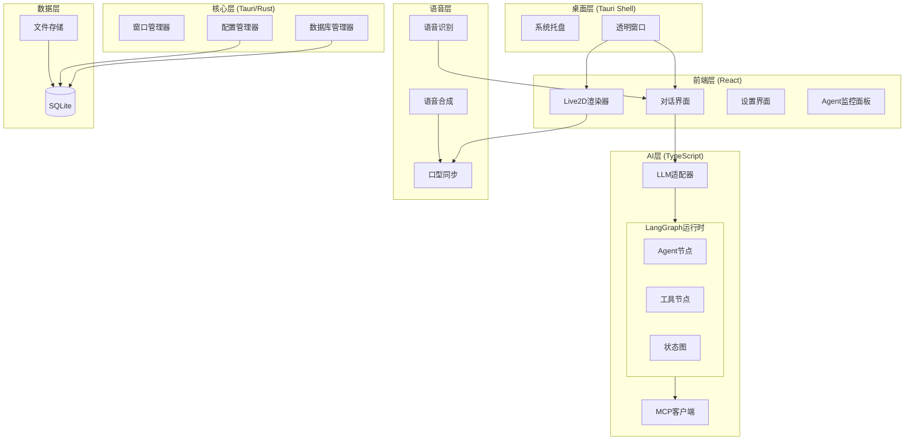

# 技术设计文档 (design.md)

## 项目目标

构建一个跨平台（macOS/Windows/Linux）的AI桌面宠物应用，具备Live2D渲染、AI对话、语音交互、多Agent协作、MCP扩展能力，数据本地存储。

---

## 技术选型与理由

### 桌面框架：Tauri 2.0

| 方案 | 优点 | 缺点 |
|------|------|------|
| **Tauri 2.0** (选定) | 内存占用小(~20MB)、启动快、Rust后端安全高效 | 生态相对年轻 |
| Electron | 生态成熟 | 内存占用大(~150MB+) |

### 前端框架：React 19 + TypeScript

- 生态成熟、Live2D库支持好
- 状态管理：Zustand
- 构建工具：Vite

### Live2D渲染：PixiJS + pixi-live2d-display

- PixiJS作为2D渲染引擎
- pixi-live2d-display处理Cubism 4.x模型

### AI/LLM集成：Vercel AI SDK

- 统一接口适配OpenAI、Anthropic、Ollama
- 原生流式输出支持

### 多Agent框架：LangGraph.js

| 方案 | 优点 | 缺点 |
|------|------|------|
| **LangGraph.js** (选定) | 成熟的状态机编排、可视化调试、社区活跃 | 依赖较重 |
| 自研 | 轻量可控 | 开发成本高 |

### 语音系统

| 功能 | 主方案 | 备选 |
|------|------|------|
| STT | Whisper (本地) | Web Speech API |
| TTS | Edge TTS (免费) | OpenAI TTS |

### MCP客户端

- @modelcontextprotocol/sdk 官方SDK
- 支持stdio和HTTP传输

### 数据存储：SQLite

- 嵌入式数据库，零配置
- 通过tauri-plugin-sql访问
- 用户数据完全本地化

---

## 总体架构



---

## 项目目录结构

```
ai-desktop-pet/
├── src-tauri/                    # Tauri Rust 后端
│   ├── src/
│   │   ├── main.rs
│   │   ├── lib.rs
│   │   ├── commands/
│   │   │   ├── mod.rs
│   │   │   ├── window.rs         # 窗口控制
│   │   │   ├── config.rs         # 配置管理
│   │   │   └── database.rs       # 数据库操作
│   │   └── utils/
│   ├── Cargo.toml
│   └── tauri.conf.json
│
├── src/                          # React 前端
│   ├── main.tsx
│   ├── App.tsx
│   │
│   ├── components/
│   │   ├── pet/
│   │   │   ├── PetCanvas.tsx
│   │   │   ├── PetController.tsx
│   │   │   └── EmotionManager.tsx
│   │   ├── chat/
│   │   │   ├── ChatWindow.tsx
│   │   │   ├── ChatInput.tsx
│   │   │   └── ChatMessage.tsx
│   │   ├── agent/
│   │   │   ├── AgentPanel.tsx
│   │   │   ├── ToolCallLog.tsx
│   │   │   └── WorkflowVisualizer.tsx
│   │   ├── settings/
│   │   │   ├── SettingsWindow.tsx
│   │   │   ├── LLMSettings.tsx
│   │   │   ├── VoiceSettings.tsx
│   │   │   ├── MCPSettings.tsx
│   │   │   └── SkinSettings.tsx
│   │   └── common/
│   │
│   ├── hooks/
│   │   ├── useLive2D.ts
│   │   ├── useChat.ts
│   │   ├── useAgent.ts
│   │   ├── useVoice.ts
│   │   └── useMCP.ts
│   │
│   ├── services/
│   │   ├── llm/
│   │   │   ├── index.ts
│   │   │   ├── adapter.ts        # Vercel AI SDK封装
│   │   │   └── types.ts
│   │   ├── agent/
│   │   │   ├── graph.ts          # LangGraph状态图定义
│   │   │   ├── nodes.ts          # Agent节点实现
│   │   │   ├── tools/
│   │   │   │   ├── index.ts
│   │   │   │   ├── search.ts
│   │   │   │   ├── weather.ts
│   │   │   │   ├── clipboard.ts
│   │   │   │   └── filesystem.ts
│   │   │   └── workflows/
│   │   │       ├── research.ts
│   │   │       └── content.ts
│   │   ├── voice/
│   │   │   ├── stt.ts
│   │   │   ├── tts.ts
│   │   │   └── lip-sync.ts
│   │   ├── mcp/
│   │   │   ├── client.ts
│   │   │   └── manager.ts
│   │   └── database/
│   │       ├── index.ts
│   │       ├── conversations.ts
│   │       └── config.ts
│   │
│   ├── stores/
│   │   ├── petStore.ts
│   │   ├── chatStore.ts
│   │   ├── agentStore.ts
│   │   └── configStore.ts
│   │
│   ├── types/
│   │   ├── pet.ts
│   │   ├── chat.ts
│   │   ├── agent.ts
│   │   ├── mcp.ts
│   │   └── config.ts
│   │
│   └── styles/
│
├── public/
│   └── models/                   # 默认Live2D模型
│       ├── default/
│       └── cat/
│
├── package.json
├── tsconfig.json
├── vite.config.ts
└── README.md
```

---

## 前后端核心入口与数据流

### 前端（React / Vite）侧

#### 入口：`src/main.tsx`

- 浏览器 / WebView 启动后在 `#root` 节点挂载 React 应用：根据 URL 查询参数 `?test=scheduler` 判断是否进入调度器测试模式：
  - 正常模式：渲染主应用 `<App />`
  - 测试模式：渲染 `<SchedulerTestApp />`
- 因此日常运行时的前端逻辑都由 `App` 组件驱动。

#### 主界面：`src/App.tsx` 的职责

`App` 是前端的“启动总线”和主 UI 容器，主要负责：

- 初始化数据库、配置、皮肤、宠物状态、统计和成就服务；
- 初始化前端调度管理器 `SchedulerManager`；
- 与 Tauri 窗口和托盘事件交互；
- 接收定时任务事件并调起 `AgentRuntime` 执行智能体任务；
- 渲染宠物、聊天窗口和全局 Toast。

核心启动流程（挂载时的 `useEffect`）：

1. 调用 `initDatabase()` 初始化本地 SQLite（通过 Tauri SQL 插件）。
2. 使用 `useConfigStore.loadConfig()` 读取配置并写入全局 store。
3. 在 Tauri 环境下，根据配置设置窗口尺寸、置顶、是否记住上次位置、是否鼠标穿透以及是否启动即最小化。
4. 加载并切换当前皮肤（通过 `useSkinStore` 与 `getSkinManager()`）。
5. 加载宠物状态（`usePetStatusStore.loadStatus()`）。
6. 初始化统计服务 `initializeStatsService()` 与成就系统 `initializeAchievements()`。
7. 获取单例 `getSchedulerManager()` 并调用 `initialize()`，设置与 Tauri 调度器相关的事件监听。
8. 所有步骤成功后将 `dbReady` 置为 `true`，显示正式 UI，并弹出欢迎气泡。

当组件卸载时，会调用 `scheduler.cleanup()` 清理事件监听，避免内存泄漏。

#### 托盘事件到前端的流转

`App` 通过 `@tauri-apps/api/event` 的 `listen()` 订阅由 Rust 端托盘菜单触发的事件：

- `open-settings`：托盘点击“设置中心”触发，前端收到后打开 / 聚焦设置窗口（开发环境使用 Vite dev server URL，生产环境使用 `settings.html`）。
- `click-through-changed`：托盘勾选或取消“鼠标穿透”触发，前端更新 `useConfigStore` 中的配置并持久化。

这样，托盘操作就能直接驱动前端配置和窗口行为的变化。

#### 调度事件到前端 UI 与 Agent 的流转

调度相关事件的链路是：

1. Rust 调度器在任务到期执行时，通过 `app.emit` 发出：
   - `task_notification`
   - `task_agent_execute`
   - `task_workflow_execute`
2. 前端 `SchedulerManager.initialize()` 调用 Tauri 的 `listen()` 监听上述事件，并在内部转换为更抽象的事件：
   - `notification`
   - `agent_execute`
   - `workflow_execute`
3. `App` 在自己的 `useEffect` 中通过 `scheduler.on(...)` 订阅这些事件：
   - `notification`：弹出 Toast，并通过 `usePetStore.showBubble()` 让宠物显示气泡提示；
   - `agent_execute`：读取当前 LLM 配置，构造 `AgentRuntime`，使用调度任务下发的 prompt 和工具限制执行，并根据结果更新宠物情绪和气泡；
   - `workflow_execute`：目前主要做通知提示（例如收到某个 workflow 的执行请求）。

整体来看，**调度事件从 Rust 发出，经由 Tauri 事件总线 → `SchedulerManager` → React 组件，最终反馈到宠物 UI 与 AgentRuntime**。

#### 配置变化到窗口 / 托盘的同步

`App` 还通过多个 `useEffect` 对配置变化进行监听和同步：

- 当窗口尺寸或置顶配置变化时，重新调用 `getCurrentWindow().setSize()` / `setAlwaysOnTop()` 等接口，调整 Tauri 窗口行为；
- 当皮肤 ID 变化时，通过 `getSkinManager().switchSkin()` 切换宠物外观；
- 当鼠标穿透开关变化时，除了设置 `setIgnoreCursorEvents` 之外，还通过 `invoke('set_tray_click_through_checked', { enabled })` 同步托盘菜单中的勾选状态。

#### 最终 UI 结构

在 `dbReady` 为 `true` 时，`App` 渲染：

- `PetContainer`：桌面宠物本体，负责 Live2D 渲染、表情和气泡等；
- `ChatWindow`：聊天窗口，可通过回调打开 / 关闭；
- `ToastContainer`：全局 Toast 提示容器。

在初始化未完成之前，则渲染一个全屏的 loading 动画以避免空白或异常闪烁。

### Tauri / Rust 端

#### 入口：`src-tauri/src/main.rs` 和 `lib.rs`

- 主函数位于 `src-tauri/src/main.rs`，实际调用库函数 `ai_desktop_pet_lib::run()`；
- `run()` 在 `src-tauri/src/lib.rs` 中实现，用于构建整个 Tauri 应用：
  - 创建 `tauri::Builder::default()`；
  - 通过 `invoke_handler(generate_handler![...])` 注册一批可供前端 `invoke()` 的命令：
    - 调度器相关：`scheduler_create_task` / `scheduler_get_task` / `scheduler_get_all_tasks` / `scheduler_update_task` / `scheduler_delete_task` / `scheduler_enable_task` / `scheduler_execute_now` / `scheduler_get_executions`；
    - macOS 上额外注册 `set_tray_click_through_checked` 以同步托盘勾选状态；
  - 挂载各类插件：`tauri-plugin-sql`、`shell`、`dialog`、`fs`、`opener`、`clipboard_manager`、`global_shortcut`；
  - 在 `setup` 回调中：
    - 获取主窗口 `main` 的 Webview；
    - 创建并启动 `SchedulerRunner` 后台调度线程，并通过 `app.manage()` 注册到全局状态；
    - 调试模式下打开 DevTools；
    - macOS 上构建托盘图标和菜单，并绑定菜单事件；
    - 设置主窗口为无边框、背景透明，以实现贴在桌面的宠物效果。

#### 托盘菜单与前端事件

在 `lib.rs` 的 `setup` 中，使用 `TrayIconBuilder` 创建托盘图标与菜单项（设置中心、鼠标穿透、显示/隐藏、退出等），并通过 `on_menu_event` 响应用户点击：

- `tray_open_settings`：
  - 强制关闭鼠标穿透，避免无法操作设置窗口；
  - `app.emit("click-through-changed", { enabled: false })` 通知前端同步状态；
  - 显示并聚焦主窗口，同时发出 `open-settings` 事件让前端打开设置界面。
- `tray_click_through`：
  - 翻转内部原子布尔值并调用 `main_window.set_ignore_cursor_events(enabled)`；
  - 更新托盘菜单项的勾选状态；
  - `app.emit("click-through-changed", { enabled })` 通知前端更新配置。
- `tray_toggle_visibility`：切换主窗口的显示 / 隐藏状态。
- `tray_quit`：调用 `app.exit(0)` 退出应用。

#### 调度器核心：`SchedulerRunner` 与 `scheduler.rs`

- `SchedulerRunner` 在 `setup` 中被创建并调用 `start()`：
  - 内部使用 `tauri::async_runtime::spawn_blocking` 启动一个阻塞线程；
  - 在线程循环中：
    1. 检查停止标记；
    2. 调用 `tick(&app)`；
    3. `std::thread::sleep(Duration::from_millis(1000))` 降低 CPU 唤醒频率。

- `tick(app)` 的主要逻辑：
  1. 计算当前时间戳（毫秒）；
  2. 通过 `app.path().app_data_dir()` 打开（或创建）应用数据目录下的 `pet.db`；
  3. 调用 `ensure_tables()` 确保存储任务和执行记录的表存在；
  4. 查询所有到期任务 `list_due_tasks(conn, now_ms)`；
  5. 对每个到期任务调用 `execute_task(app, conn, task)`。

- `execute_task` 的工作：
  1. 生成执行记录 ID，往 `task_executions` 表插入一条状态为 `running` 的记录；
  2. 通过 `app.emit("task_started", task.id)` 通知前端任务开始；
  3. 根据 `task.action_type` 分支：
     - `notification`：解析配置，构造 JSON payload 并 `emit("task_notification", payload)`；
     - `agent_task`：解析配置，构造 prompt、工具列表、最大步数等信息并 `emit("task_agent_execute", payload)`；
     - `workflow`：解析配置并 `emit("task_workflow_execute", payload)`；
     - 其他 / 不支持类型则置为失败并记录错误；
  4. 更新执行记录状态（`success` / `failed`）、完成时间和结果或错误信息；
  5. 根据触发类型（interval / cron / manual / event）计算下一次执行时间并更新任务表中的 `last_run` / `next_run`；
  6. 根据执行结果向前端发出 `task_completed` 或 `task_failed` 事件。

#### 调度器对外暴露的 Tauri Commands

`scheduler.rs` 中通过一组 `#[tauri::command]` 函数提供任务管理接口，前端通过 `invoke()` 调用：

- `scheduler_create_task`：创建新任务，写入 `tasks` 表并返回任务 ID；
- `scheduler_get_task` / `scheduler_get_all_tasks`：查询单个任务或任务列表；
- `scheduler_update_task`：支持按字段部分更新任务，并据此重新计算 `next_run`；
- `scheduler_delete_task`：删除任务；
- `scheduler_enable_task`：启用 / 禁用任务，同时更新 `next_run`；
- `scheduler_execute_now`：立即执行指定任务一次；
- `scheduler_get_executions`：按任务 ID 查询执行历史记录，支持设置返回条数上限。

前端 `SchedulerManager` 对这些命令做了薄封装，负责：

- 将前端的结构化配置 JSON 序列化为字符串传给 Rust；
- 解析 Rust 返回的 JSON 字段（如 trigger / action / metadata 配置）为 TypeScript 类型；
- 屏蔽具体命令名称，对外提供 `createTask` / `getTask` / `getAllTasks` / `updateTask` / `deleteTask` / `enableTask` / `executeNow` / `getExecutions` 等方法。

---

## 数据表结构 (SQLite)

```sql
-- 对话会话表
CREATE TABLE conversations (
    id TEXT PRIMARY KEY,
    title TEXT,
    system_prompt TEXT,
    created_at INTEGER NOT NULL,
    updated_at INTEGER NOT NULL
);

-- 对话消息表
CREATE TABLE messages (
    id TEXT PRIMARY KEY,
    conversation_id TEXT NOT NULL,
    role TEXT NOT NULL,           -- 'user' | 'assistant' | 'system' | 'tool'
    content TEXT NOT NULL,
    tool_calls TEXT,              -- JSON: 工具调用信息
    tool_call_id TEXT,
    created_at INTEGER NOT NULL,
    FOREIGN KEY (conversation_id) REFERENCES conversations(id) ON DELETE CASCADE
);

-- 配置表
CREATE TABLE config (
    key TEXT PRIMARY KEY,
    value TEXT NOT NULL,
    updated_at INTEGER NOT NULL
);

-- MCP服务器配置表
CREATE TABLE mcp_servers (
    id TEXT PRIMARY KEY,
    name TEXT NOT NULL,
    transport TEXT NOT NULL,      -- 'stdio' | 'http'
    command TEXT,
    args TEXT,                    -- JSON
    url TEXT,
    env TEXT,                     -- JSON: 环境变量
    enabled INTEGER DEFAULT 1,
    created_at INTEGER NOT NULL
);

-- Agent角色定义表
CREATE TABLE agent_roles (
    id TEXT PRIMARY KEY,
    name TEXT NOT NULL,
    description TEXT,
    system_prompt TEXT NOT NULL,
    tools TEXT,                   -- JSON: 可用工具ID列表
    created_at INTEGER NOT NULL
);

-- 工作流模板表
CREATE TABLE workflows (
    id TEXT PRIMARY KEY,
    name TEXT NOT NULL,
    description TEXT,
    graph_definition TEXT NOT NULL,  -- JSON: LangGraph状态图定义
    created_at INTEGER NOT NULL
);

-- 皮肤/模型表
CREATE TABLE skins (
    id TEXT PRIMARY KEY,
    name TEXT NOT NULL,
    path TEXT NOT NULL,           -- 模型文件路径
    preview_image TEXT,           -- 预览图路径
    is_builtin INTEGER DEFAULT 0,
    created_at INTEGER NOT NULL
);

-- 创建索引
CREATE INDEX idx_messages_conversation ON messages(conversation_id);
CREATE INDEX idx_messages_created ON messages(created_at);
```

---

## 核心接口设计

### Tauri Commands

```typescript
// 窗口控制
invoke('set_window_position', { x: number, y: number }): Promise<void>
invoke('set_window_size', { width: number, height: number }): Promise<void>
invoke('set_always_on_top', { enabled: boolean }): Promise<void>
invoke('set_click_through', { enabled: boolean }): Promise<void>

// 数据库
invoke('db_execute', { query: string, params: unknown[] }): Promise<number>
invoke('db_select', { query: string, params: unknown[] }): Promise<unknown[]>

// 文件系统
invoke('read_model_file', { path: string }): Promise<number[]>
invoke('import_skin_pack', { zipPath: string }): Promise<SkinMeta>
invoke('get_app_data_dir'): Promise<string>

// 系统
invoke('open_url', { url: string }): Promise<void>
invoke('read_clipboard'): Promise<string>
invoke('write_clipboard', { text: string }): Promise<void>
```

### LangGraph Agent接口

```typescript
// 状态定义
interface AgentState {
    messages: BaseMessage[]
    currentAgent: string
    toolResults: Record<string, unknown>
    status: 'idle' | 'thinking' | 'executing' | 'done' | 'error'
}

// 图定义
const agentGraph = new StateGraph<AgentState>({
    channels: { ... }
})
    .addNode('supervisor', supervisorNode)
    .addNode('researcher', researcherNode)
    .addNode('executor', executorNode)
    .addNode('tools', toolNode)
    .addEdge('supervisor', routeToAgent)
    .addEdge('researcher', 'tools')
    .addEdge('executor', 'tools')
    .addEdge('tools', 'supervisor')
    .compile()

// 运行
async function* runAgent(task: string): AsyncGenerator<AgentEvent> {
    const stream = await agentGraph.stream({
        messages: [new HumanMessage(task)]
    })
    for await (const event of stream) {
        yield event
    }
}
```

### 前端Service接口

```typescript
// LLM Service
interface LLMService {
    chat(params: {
        messages: Message[]
        model: string
        stream: boolean
    }): AsyncGenerator<string>
}

// Agent Service
interface AgentService {
    runTask(task: string): AsyncGenerator<AgentEvent>
    runWorkflow(workflowId: string, input: unknown): AsyncGenerator<AgentEvent>
    cancelTask(): void
}

// Voice Service
interface VoiceService {
    startListening(): void
    stopListening(): void
    speak(text: string, voiceId?: string): Promise<void>
    onTranscript: (callback: (text: string) => void) => void
}

// MCP Service
interface MCPService {
    connect(config: MCPServerConfig): Promise<MCPConnection>
    disconnect(serverId: string): void
    listTools(serverId: string): Promise<Tool[]>
    callTool(serverId: string, toolName: string, args: unknown): Promise<unknown>
}
```

---

## 错误处理机制

### 错误码定义

```typescript
enum ErrorCode {
    // 网络 1xxx
    NETWORK_TIMEOUT = 1001,
    NETWORK_OFFLINE = 1002,

    // LLM 2xxx
    LLM_AUTH_FAILED = 2001,
    LLM_RATE_LIMIT = 2002,
    LLM_CONTEXT_TOO_LONG = 2003,

    // Agent 3xxx
    AGENT_TOOL_NOT_FOUND = 3001,
    AGENT_TOOL_FAILED = 3002,
    AGENT_PERMISSION_DENIED = 3003,
    AGENT_TIMEOUT = 3004,

    // MCP 4xxx
    MCP_CONNECTION_FAILED = 4001,
    MCP_SERVER_ERROR = 4002,

    // 存储 5xxx
    DB_READ_FAILED = 5001,
    DB_WRITE_FAILED = 5002,
    FILE_NOT_FOUND = 5003,

    // 语音 6xxx
    MIC_ACCESS_DENIED = 6001,
    STT_FAILED = 6002,
    TTS_FAILED = 6003,
}
```

### 处理策略

| 错误类型 | 策略 | 用户反馈 |
|----------|------|----------|
| 网络超时 | 重试3次，指数退避 | Toast + 重试按钮 |
| API认证失败 | 不重试 | 弹窗引导配置 |
| 工具执行失败 | 记录日志，Agent自行处理 | 面板显示错误 |
| 数据库错误 | 降级内存，重启恢复 | Toast警告 |

---

## 性能优化

1. **渲染优化**
   - 空闲降帧至15fps
   - 最小化时暂停渲染

2. **内存控制**
   - Live2D模型懒加载
   - 对话历史分页
   - 定时清理缓存

3. **启动优化**
   - 代码分割
   - 预加载关键资源
