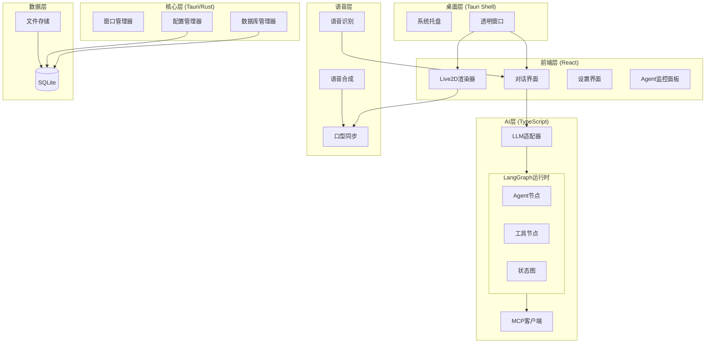

# 技术设计文档 (design.md)

## 项目目标

构建一个跨平台（macOS/Windows/Linux）的AI桌面宠物应用，具备Live2D渲染、AI对话、语音交互、多Agent协作、MCP扩展能力，数据本地存储。

---

## 技术选型与理由

### 桌面框架：Tauri 2.0

| 方案 | 优点 | 缺点 |
|------|------|------|
| **Tauri 2.0** (选定) | 内存占用小(~20MB)、启动快、Rust后端安全高效 | 生态相对年轻 |
| Electron | 生态成熟 | 内存占用大(~150MB+) |

### 前端框架：React 19 + TypeScript

- 生态成熟、Live2D库支持好
- 状态管理：Zustand
- 构建工具：Vite

### Live2D渲染：PixiJS + pixi-live2d-display

- PixiJS作为2D渲染引擎
- pixi-live2d-display处理Cubism 4.x模型

### AI/LLM集成：Vercel AI SDK

- 统一接口适配OpenAI、Anthropic、Ollama
- 原生流式输出支持

### 多Agent框架：LangGraph.js

| 方案 | 优点 | 缺点 |
|------|------|------|
| **LangGraph.js** (选定) | 成熟的状态机编排、可视化调试、社区活跃 | 依赖较重 |
| 自研 | 轻量可控 | 开发成本高 |

### 语音系统

| 功能 | 主方案 | 备选 |
|------|------|------|
| STT | Whisper (本地) | Web Speech API |
| TTS | Edge TTS (免费) | OpenAI TTS |

### MCP客户端

- @modelcontextprotocol/sdk 官方SDK
- 支持stdio和HTTP传输

### 数据存储：SQLite

- 嵌入式数据库，零配置
- 通过tauri-plugin-sql访问
- 用户数据完全本地化

---

## 总体架构



---

## 项目目录结构

```
ai-desktop-pet/
├── src-tauri/                    # Tauri Rust 后端
│   ├── src/
│   │   ├── main.rs
│   │   ├── lib.rs
│   │   ├── commands/
│   │   │   ├── mod.rs
│   │   │   ├── window.rs         # 窗口控制
│   │   │   ├── config.rs         # 配置管理
│   │   │   └── database.rs       # 数据库操作
│   │   └── utils/
│   ├── Cargo.toml
│   └── tauri.conf.json
│
├── src/                          # React 前端
│   ├── main.tsx
│   ├── App.tsx
│   │
│   ├── components/
│   │   ├── pet/
│   │   │   ├── PetCanvas.tsx
│   │   │   ├── PetController.tsx
│   │   │   └── EmotionManager.tsx
│   │   ├── chat/
│   │   │   ├── ChatWindow.tsx
│   │   │   ├── ChatInput.tsx
│   │   │   └── ChatMessage.tsx
│   │   ├── agent/
│   │   │   ├── AgentPanel.tsx
│   │   │   ├── ToolCallLog.tsx
│   │   │   └── WorkflowVisualizer.tsx
│   │   ├── settings/
│   │   │   ├── SettingsWindow.tsx
│   │   │   ├── LLMSettings.tsx
│   │   │   ├── VoiceSettings.tsx
│   │   │   ├── MCPSettings.tsx
│   │   │   └── SkinSettings.tsx
│   │   └── common/
│   │
│   ├── hooks/
│   │   ├── useLive2D.ts
│   │   ├── useChat.ts
│   │   ├── useAgent.ts
│   │   ├── useVoice.ts
│   │   └── useMCP.ts
│   │
│   ├── services/
│   │   ├── llm/
│   │   │   ├── index.ts
│   │   │   ├── adapter.ts        # Vercel AI SDK封装
│   │   │   └── types.ts
│   │   ├── agent/
│   │   │   ├── graph.ts          # LangGraph状态图定义
│   │   │   ├── nodes.ts          # Agent节点实现
│   │   │   ├── tools/
│   │   │   │   ├── index.ts
│   │   │   │   ├── search.ts
│   │   │   │   ├── weather.ts
│   │   │   │   ├── clipboard.ts
│   │   │   │   └── filesystem.ts
│   │   │   └── workflows/
│   │   │       ├── research.ts
│   │   │       └── content.ts
│   │   ├── voice/
│   │   │   ├── stt.ts
│   │   │   ├── tts.ts
│   │   │   └── lip-sync.ts
│   │   ├── mcp/
│   │   │   ├── client.ts
│   │   │   └── manager.ts
│   │   └── database/
│   │       ├── index.ts
│   │       ├── conversations.ts
│   │       └── config.ts
│   │
│   ├── stores/
│   │   ├── petStore.ts
│   │   ├── chatStore.ts
│   │   ├── agentStore.ts
│   │   └── configStore.ts
│   │
│   ├── types/
│   │   ├── pet.ts
│   │   ├── chat.ts
│   │   ├── agent.ts
│   │   ├── mcp.ts
│   │   └── config.ts
│   │
│   └── styles/
│
├── public/
│   └── models/                   # 默认Live2D模型
│       ├── default/
│       └── cat/
│
├── package.json
├── tsconfig.json
├── vite.config.ts
└── README.md
```

---

## 数据表结构 (SQLite)

```sql
-- 对话会话表
CREATE TABLE conversations (
    id TEXT PRIMARY KEY,
    title TEXT,
    system_prompt TEXT,
    created_at INTEGER NOT NULL,
    updated_at INTEGER NOT NULL
);

-- 对话消息表
CREATE TABLE messages (
    id TEXT PRIMARY KEY,
    conversation_id TEXT NOT NULL,
    role TEXT NOT NULL,           -- 'user' | 'assistant' | 'system' | 'tool'
    content TEXT NOT NULL,
    tool_calls TEXT,              -- JSON: 工具调用信息
    tool_call_id TEXT,
    created_at INTEGER NOT NULL,
    FOREIGN KEY (conversation_id) REFERENCES conversations(id) ON DELETE CASCADE
);

-- 配置表
CREATE TABLE config (
    key TEXT PRIMARY KEY,
    value TEXT NOT NULL,
    updated_at INTEGER NOT NULL
);

-- MCP服务器配置表
CREATE TABLE mcp_servers (
    id TEXT PRIMARY KEY,
    name TEXT NOT NULL,
    transport TEXT NOT NULL,      -- 'stdio' | 'http'
    command TEXT,
    args TEXT,                    -- JSON
    url TEXT,
    env TEXT,                     -- JSON: 环境变量
    enabled INTEGER DEFAULT 1,
    created_at INTEGER NOT NULL
);

-- Agent角色定义表
CREATE TABLE agent_roles (
    id TEXT PRIMARY KEY,
    name TEXT NOT NULL,
    description TEXT,
    system_prompt TEXT NOT NULL,
    tools TEXT,                   -- JSON: 可用工具ID列表
    created_at INTEGER NOT NULL
);

-- 工作流模板表
CREATE TABLE workflows (
    id TEXT PRIMARY KEY,
    name TEXT NOT NULL,
    description TEXT,
    graph_definition TEXT NOT NULL,  -- JSON: LangGraph状态图定义
    created_at INTEGER NOT NULL
);

-- 皮肤/模型表
CREATE TABLE skins (
    id TEXT PRIMARY KEY,
    name TEXT NOT NULL,
    path TEXT NOT NULL,           -- 模型文件路径
    preview_image TEXT,           -- 预览图路径
    is_builtin INTEGER DEFAULT 0,
    created_at INTEGER NOT NULL
);

-- 创建索引
CREATE INDEX idx_messages_conversation ON messages(conversation_id);
CREATE INDEX idx_messages_created ON messages(created_at);
```

---

## 核心接口设计

### Tauri Commands

```typescript
// 窗口控制
invoke('set_window_position', { x: number, y: number }): Promise<void>
invoke('set_window_size', { width: number, height: number }): Promise<void>
invoke('set_always_on_top', { enabled: boolean }): Promise<void>
invoke('set_click_through', { enabled: boolean }): Promise<void>

// 数据库
invoke('db_execute', { query: string, params: unknown[] }): Promise<number>
invoke('db_select', { query: string, params: unknown[] }): Promise<unknown[]>

// 文件系统
invoke('read_model_file', { path: string }): Promise<number[]>
invoke('import_skin_pack', { zipPath: string }): Promise<SkinMeta>
invoke('get_app_data_dir'): Promise<string>

// 系统
invoke('open_url', { url: string }): Promise<void>
invoke('read_clipboard'): Promise<string>
invoke('write_clipboard', { text: string }): Promise<void>
```

### LangGraph Agent接口

```typescript
// 状态定义
interface AgentState {
    messages: BaseMessage[]
    currentAgent: string
    toolResults: Record<string, unknown>
    status: 'idle' | 'thinking' | 'executing' | 'done' | 'error'
}

// 图定义
const agentGraph = new StateGraph<AgentState>({
    channels: { ... }
})
    .addNode('supervisor', supervisorNode)
    .addNode('researcher', researcherNode)
    .addNode('executor', executorNode)
    .addNode('tools', toolNode)
    .addEdge('supervisor', routeToAgent)
    .addEdge('researcher', 'tools')
    .addEdge('executor', 'tools')
    .addEdge('tools', 'supervisor')
    .compile()

// 运行
async function* runAgent(task: string): AsyncGenerator<AgentEvent> {
    const stream = await agentGraph.stream({
        messages: [new HumanMessage(task)]
    })
    for await (const event of stream) {
        yield event
    }
}
```

### 前端Service接口

```typescript
// LLM Service
interface LLMService {
    chat(params: {
        messages: Message[]
        model: string
        stream: boolean
    }): AsyncGenerator<string>
}

// Agent Service
interface AgentService {
    runTask(task: string): AsyncGenerator<AgentEvent>
    runWorkflow(workflowId: string, input: unknown): AsyncGenerator<AgentEvent>
    cancelTask(): void
}

// Voice Service
interface VoiceService {
    startListening(): void
    stopListening(): void
    speak(text: string, voiceId?: string): Promise<void>
    onTranscript: (callback: (text: string) => void) => void
}

// MCP Service
interface MCPService {
    connect(config: MCPServerConfig): Promise<MCPConnection>
    disconnect(serverId: string): void
    listTools(serverId: string): Promise<Tool[]>
    callTool(serverId: string, toolName: string, args: unknown): Promise<unknown>
}
```

---

## 错误处理机制

### 错误码定义

```typescript
enum ErrorCode {
    // 网络 1xxx
    NETWORK_TIMEOUT = 1001,
    NETWORK_OFFLINE = 1002,

    // LLM 2xxx
    LLM_AUTH_FAILED = 2001,
    LLM_RATE_LIMIT = 2002,
    LLM_CONTEXT_TOO_LONG = 2003,

    // Agent 3xxx
    AGENT_TOOL_NOT_FOUND = 3001,
    AGENT_TOOL_FAILED = 3002,
    AGENT_PERMISSION_DENIED = 3003,
    AGENT_TIMEOUT = 3004,

    // MCP 4xxx
    MCP_CONNECTION_FAILED = 4001,
    MCP_SERVER_ERROR = 4002,

    // 存储 5xxx
    DB_READ_FAILED = 5001,
    DB_WRITE_FAILED = 5002,
    FILE_NOT_FOUND = 5003,

    // 语音 6xxx
    MIC_ACCESS_DENIED = 6001,
    STT_FAILED = 6002,
    TTS_FAILED = 6003,
}
```

### 处理策略

| 错误类型 | 策略 | 用户反馈 |
|----------|------|----------|
| 网络超时 | 重试3次，指数退避 | Toast + 重试按钮 |
| API认证失败 | 不重试 | 弹窗引导配置 |
| 工具执行失败 | 记录日志，Agent自行处理 | 面板显示错误 |
| 数据库错误 | 降级内存，重启恢复 | Toast警告 |

---

## 性能优化

1. **渲染优化**
   - 空闲降帧至15fps
   - 最小化时暂停渲染

2. **内存控制**
   - Live2D模型懒加载
   - 对话历史分页
   - 定时清理缓存

3. **启动优化**
   - 代码分割
   - 预加载关键资源
