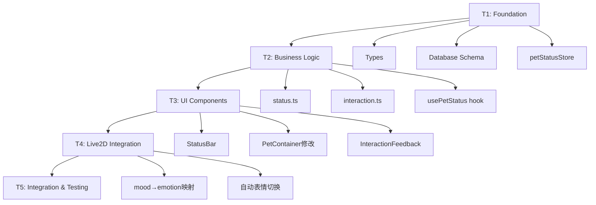

# Phase 1 开发任务拆分 - 宠物养成系统

## 文档信息
- **版本**: v1.0
- **创建日期**: 2025-12-26
- **估算周期**: 10个工作日（2周）
- **参考PRD**: [PRD-宠物养成系统.md](./PRD-宠物养成系统.md)

---

## 架构分析

### 现有代码库集成点

**1. Live2D系统** (`services/live2d/manager.ts`)
- ✅ 已有 `triggerEmotion(emotion: EmotionType)` 方法
- ✅ Emotion类型已定义：happy/sad/angry/surprised/thinking/neutral/excited/confused
- ⚠️ 需扩展：mood数值 → emotion映射逻辑
- ⚠️ 当前只有tips反馈，无真实动画控制（OhMyLive2D限制）

**2. PetContainer组件** (`components/pet/PetContainer.tsx`)
- ✅ 已有 `data-tauri-drag-region` 支持拖动
- ✅ 已有右键菜单系统
- ⚠️ 需添加：左键点击检测 + 区域判断
- ⚠️ 需处理：点击与拖动的冲突（移动距离阈值）

**3. Store架构** (`stores/`)
- ✅ 已有petStore管理emotion/position等状态
- ✅ Zustand模式清晰：状态 + actions
- ⚠️ 需新建：petStatusStore管理mood/energy/intimacy

**4. 数据库** (`services/database/index.ts`)
- ✅ SQLite初始化流程清晰
- ✅ Schema集中管理在SCHEMA常量
- ⚠️ 需扩展：在SCHEMA中添加pet_status表

### 技术约束
1. **类型安全**: 无any类型，使用strict模式
2. **文件大小**: 单文件<500行
3. **路径别名**: 使用 `@/` 而非相对路径
4. **包管理**: 使用pnpm，非npm
5. **数据持久化**: SQLite，非localStorage

### 关键依赖关系


---

## Sprint 计划

### Sprint 1: Foundation（Day 1-2，必须完成后才能开始其他）
**目标**: 建立数据结构和存储基础

- **T1.1**: 类型定义
- **T1.2**: 数据库Schema扩展
- **T1.3**: petStatusStore实现
- **T1.4**: 数据库操作层

**阻塞关系**: Sprint 2/3/4全部依赖Sprint 1

---

### Sprint 2: Business Logic（Day 3-5，部分可并行）
**目标**: 实现核心业务逻辑

- **T2.1**: 属性计算服务（依赖T1）
- **T2.2**: 互动处理服务（依赖T2.1）
- **T2.3**: usePetStatus hook（依赖T2.1）
- **T4.1**: Live2D API调研（可并行）
- **T4.2**: mood→emotion映射设计（依赖T4.1）

**并行策略**: T2.1 + T4.1可同时开工

---

### Sprint 3: UI Components（Day 6-8，部分可并行）
**目标**: 构建用户界面

- **T3.1**: StatusBar组件（依赖T1.3, T2.3）
- **T3.2**: PetContainer点击检测（依赖T2.2）
- **T3.3**: InteractionFeedback组件（依赖T2.2）
- **T4.3**: 表情自动切换（依赖T4.2, T3.2）

**并行策略**: T3.1 + T3.2可同时开工，T3.3等T3.2完成

---

### Sprint 4: Integration & Polish（Day 9-10，串行）
**目标**: 集成测试和优化

- **T5.1**: App.tsx初始化流程
- **T5.2**: 端到端测试
- **T5.3**: 性能优化
- **T5.4**: Bug修复

---

## 详细任务清单

### 🔵 T1.1: 类型定义

**文件**: `src/types/pet-status.ts`

**描述**: 定义宠物状态、互动类型等核心数据结构

**技术细节**:
```typescript
// 需要定义的类型
export interface PetStatus {
  mood: number;              // 0-100
  energy: number;            // 0-100
  intimacy: number;          // 0-100
  lastInteraction: number;   // timestamp
  lastFeed: number;          // timestamp
  lastPlay: number;          // timestamp
  totalInteractions: number;
  createdAt: number;         // timestamp
}

export type InteractionType = 'pet' | 'feed' | 'play';

export interface InteractionConfig {
  type: InteractionType;
  cooldown: number;          // 秒
  effects: {
    mood: number;            // delta值
    energy: number;
    intimacy: number;
  };
  animation: string;         // Live2D动画名（可选）
  voiceResponses: string[];  // TTS回复
}

export interface InteractionResult {
  success: boolean;
  message?: string;
  newStatus: PetStatus;
  animation?: string;
  voice?: string;
}

export interface DecayConfig {
  moodPerHour: number;
  energyPerHour: number;
  maxMoodDecay: number;
  maxEnergyDecay: number;
}
```

**DoD (Definition of Done)**:
- [x] 所有类型导出到 `src/types/index.ts`
- [x] 无any类型
- [x] 所有interface有JSDoc注释
- [x] tsc --noEmit通过

**估算**: 2小时

**依赖**: 无

---

### 🔵 T1.2: 数据库Schema扩展

**文件**: `src/services/database/index.ts`

**描述**: 在现有SCHEMA中添加pet_status表

**技术细节**:
```sql
-- 在SCHEMA常量中添加
CREATE TABLE IF NOT EXISTS pet_status (
    id INTEGER PRIMARY KEY,
    mood REAL DEFAULT 80.0,
    energy REAL DEFAULT 100.0,
    intimacy REAL DEFAULT 0.0,
    last_interaction INTEGER NOT NULL,
    last_feed INTEGER,
    last_play INTEGER,
    total_interactions INTEGER DEFAULT 0,
    created_at INTEGER NOT NULL,
    updated_at INTEGER NOT NULL
);

-- 添加索引
CREATE INDEX IF NOT EXISTS idx_pet_status_updated ON pet_status(updated_at);
```

**迁移策略**:
```typescript
// 在initDatabase()后添加
async function migratePetStatus(db: Database): Promise<void> {
  // 检查是否已有记录
  const existing = await db.select<{ count: number }[]>(
    'SELECT COUNT(*) as count FROM pet_status'
  );

  if (existing[0].count === 0) {
    // 首次启动，插入默认状态
    await db.execute(
      `INSERT INTO pet_status (id, last_interaction, created_at, updated_at)
       VALUES (1, ?, ?, ?)`,
      [Date.now(), Date.now(), Date.now()]
    );
  }
}
```

**DoD**:
- [x] pet_status表创建成功
- [x] 首次启动插入默认记录
- [x] 现有用户升级后自动创建表
- [x] 无SQL语法错误

**估算**: 1小时

**依赖**: T1.1完成

---

### 🔵 T1.3: petStatusStore实现

**文件**: `src/stores/petStatusStore.ts`

**描述**: Zustand store管理宠物状态

**技术细节**:
```typescript
import { create } from 'zustand';
import type { PetStatus } from '@/types';

interface PetStatusStore {
  status: PetStatus | null;
  isLoading: boolean;
  error: Error | null;

  // Actions
  loadStatus: () => Promise<void>;
  updateStatus: (updates: Partial<PetStatus>) => Promise<void>;
  incrementInteraction: (type: InteractionType) => Promise<void>;

  // Computed
  getMoodLevel: () => 'high' | 'medium' | 'low';
  getEnergyLevel: () => 'high' | 'medium' | 'low';
  getCooldownRemaining: (type: InteractionType) => number;
}

export const usePetStatusStore = create<PetStatusStore>((set, get) => ({
  status: null,
  isLoading: false,
  error: null,

  loadStatus: async () => {
    // 实现从数据库加载
  },

  updateStatus: async (updates) => {
    // 实现更新并保存到数据库
  },

  // ... 其他actions
}));
```

**需要导出到** `src/stores/index.ts`:
```typescript
export { usePetStatusStore } from './petStatusStore';
```

**DoD**:
- [x] Store定义完整
- [x] 支持异步数据库操作
- [x] 包含computed getters
- [x] 无any类型
- [x] 已导出到index.ts

**估算**: 3小时

**依赖**: T1.1, T1.2完成

---

### 🔵 T1.4: 数据库操作层

**文件**: `src/services/database/pet-status.ts`

**描述**: 封装pet_status表的CRUD操作

**技术细节**:
```typescript
import { getDatabase } from './index';
import type { PetStatus } from '@/types';

export async function getPetStatus(): Promise<PetStatus | null> {
  const db = await getDatabase();
  const rows = await db.select<PetStatus[]>(
    'SELECT * FROM pet_status WHERE id = 1'
  );
  return rows[0] || null;
}

export async function updatePetStatus(
  updates: Partial<Omit<PetStatus, 'id' | 'createdAt'>>
): Promise<void> {
  const db = await getDatabase();
  const fields = Object.keys(updates);
  const values = Object.values(updates);

  const setClause = fields.map(f => `${f} = ?`).join(', ');

  await db.execute(
    `UPDATE pet_status SET ${setClause}, updated_at = ? WHERE id = 1`,
    [...values, Date.now()]
  );
}

export async function incrementInteractionCount(type: InteractionType): Promise<void> {
  const db = await getDatabase();
  const now = Date.now();

  await db.execute(
    `UPDATE pet_status
     SET total_interactions = total_interactions + 1,
         last_interaction = ?,
         last_${type} = ?,
         updated_at = ?
     WHERE id = 1`,
    [now, now, now]
  );
}
```

**DoD**:
- [x] 所有CRUD函数实现
- [x] 正确处理timestamp
- [x] 错误处理（try-catch）
- [x] 类型安全

**估算**: 2小时

**依赖**: T1.2完成

---

### 🟢 T2.1: 属性计算服务

**文件**: `src/services/pet/status.ts`

**描述**: 实现属性衰减、边界检查等核心逻辑

**技术细节**:
```typescript
import type { PetStatus, DecayConfig } from '@/types';

const DEFAULT_DECAY_CONFIG: DecayConfig = {
  moodPerHour: 2,
  energyPerHour: 1.5,
  maxMoodDecay: 50,
  maxEnergyDecay: 40,
};

/**
 * 基于时间差计算属性衰减
 * Linus原则：基于时间差计算，而非定时器轮询
 */
export function calculateDecay(
  lastTime: number,
  currentTime: number = Date.now(),
  config: DecayConfig = DEFAULT_DECAY_CONFIG
): { mood: number; energy: number } {
  const hoursPassed = (currentTime - lastTime) / (1000 * 60 * 60);

  return {
    mood: -Math.min(hoursPassed * config.moodPerHour, config.maxMoodDecay),
    energy: -Math.min(hoursPassed * config.energyPerHour, config.maxEnergyDecay),
  };
}

/**
 * 应用衰减到当前状态
 */
export function applyDecay(status: PetStatus): PetStatus {
  const decay = calculateDecay(status.lastInteraction);

  return {
    ...status,
    mood: clamp(status.mood + decay.mood, 0, 100),
    energy: clamp(status.energy + decay.energy, 0, 100),
  };
}

/**
 * 限制值在[min, max]范围内
 */
function clamp(value: number, min: number, max: number): number {
  return Math.max(min, Math.min(max, value));
}

/**
 * 应用互动效果到状态
 */
export function applyInteractionEffects(
  status: PetStatus,
  effects: { mood?: number; energy?: number; intimacy?: number }
): PetStatus {
  return {
    ...status,
    mood: clamp((status.mood || 0) + (effects.mood || 0), 0, 100),
    energy: clamp((status.energy || 0) + (effects.energy || 0), 0, 100),
    intimacy: clamp((status.intimacy || 0) + (effects.intimacy || 0), 0, 100),
  };
}

/**
 * 检查是否在冷却中
 */
export function checkCooldown(
  lastTime: number | undefined,
  cooldownSeconds: number
): { onCooldown: boolean; remaining: number } {
  if (!lastTime) {
    return { onCooldown: false, remaining: 0 };
  }

  const elapsed = (Date.now() - lastTime) / 1000;
  const remaining = Math.max(0, cooldownSeconds - elapsed);

  return {
    onCooldown: remaining > 0,
    remaining: Math.ceil(remaining),
  };
}
```

**单元测试** (可选，但建议添加):
```typescript
// status.test.ts
describe('calculateDecay', () => {
  it('should calculate correct decay for 1 hour', () => {
    const oneHourAgo = Date.now() - 60 * 60 * 1000;
    const decay = calculateDecay(oneHourAgo);
    expect(decay.mood).toBe(-2);
    expect(decay.energy).toBe(-1.5);
  });

  it('should not exceed max decay', () => {
    const oneMonthAgo = Date.now() - 30 * 24 * 60 * 60 * 1000;
    const decay = calculateDecay(oneMonthAgo);
    expect(decay.mood).toBe(-50);
    expect(decay.energy).toBe(-40);
  });
});
```

**DoD**:
- [x] 所有计算函数实现
- [x] 边界检查（0-100）
- [x] 性能优化（使用Math.min/max）
- [x] JSDoc注释完整
- [x] （可选）单元测试通过

**估算**: 3小时

**依赖**: T1.1完成

---

### 🟢 T2.2: 互动处理服务

**文件**: `src/services/pet/interaction.ts`

**描述**: 处理用户互动逻辑，包括冷却检查、效果应用

**技术细节**:
```typescript
import type { InteractionType, InteractionConfig, InteractionResult, PetStatus } from '@/types';
import { applyInteractionEffects, checkCooldown } from './status';

// 互动配置表
const INTERACTION_CONFIGS: Record<InteractionType, InteractionConfig> = {
  pet: {
    type: 'pet',
    cooldown: 60,
    effects: { mood: 10, energy: 0, intimacy: 2 },
    animation: 'tap_head',
    voiceResponses: ['好舒服~', '嘿嘿~', '喜欢被摸头~'],
  },
  feed: {
    type: 'feed',
    cooldown: 120,
    effects: { mood: 8, energy: 15, intimacy: 1 },
    animation: 'eat',
    voiceResponses: ['谢谢主人!', '好好吃!', '还要还要~'],
  },
  play: {
    type: 'play',
    cooldown: 90,
    effects: { mood: 12, energy: -5, intimacy: 3 },
    animation: 'happy',
    voiceResponses: ['好开心!', '再来一次!', '玩得真开心~'],
  },
};

/**
 * 处理互动请求
 */
export async function handleInteraction(
  type: InteractionType,
  currentStatus: PetStatus
): Promise<InteractionResult> {
  const config = INTERACTION_CONFIGS[type];

  // 1. 检查冷却
  const lastTime = type === 'pet'
    ? currentStatus.lastInteraction
    : type === 'feed'
      ? currentStatus.lastFeed
      : currentStatus.lastPlay;

  const cooldownCheck = checkCooldown(lastTime, config.cooldown);

  if (cooldownCheck.onCooldown) {
    return {
      success: false,
      message: `还需要等待 ${cooldownCheck.remaining} 秒`,
      newStatus: currentStatus,
    };
  }

  // 2. 应用效果
  const newStatus = applyInteractionEffects(currentStatus, config.effects);

  // 3. 随机选择语音回复
  const voice = config.voiceResponses[
    Math.floor(Math.random() * config.voiceResponses.length)
  ];

  return {
    success: true,
    newStatus,
    animation: config.animation,
    voice,
  };
}

/**
 * 获取互动配置
 */
export function getInteractionConfig(type: InteractionType): InteractionConfig {
  return INTERACTION_CONFIGS[type];
}

/**
 * 获取所有冷却状态
 */
export function getAllCooldowns(status: PetStatus): Record<InteractionType, number> {
  return {
    pet: checkCooldown(status.lastInteraction, INTERACTION_CONFIGS.pet.cooldown).remaining,
    feed: checkCooldown(status.lastFeed, INTERACTION_CONFIGS.feed.cooldown).remaining,
    play: checkCooldown(status.lastPlay, INTERACTION_CONFIGS.play.cooldown).remaining,
  };
}
```

**DoD**:
- [x] 互动处理逻辑完整
- [x] 冷却检查正确
- [x] 随机语音选择
- [x] 错误处理
- [x] 类型安全

**估算**: 3小时

**依赖**: T2.1完成

---

### 🟢 T2.3: usePetStatus Hook

**文件**: `src/hooks/usePetStatus.ts`

**描述**: React hook封装宠物状态操作，供组件使用

**技术细节**:
```typescript
import { useEffect, useCallback } from 'react';
import { usePetStatusStore } from '@/stores';
import { handleInteraction } from '@/services/pet/interaction';
import { applyDecay } from '@/services/pet/status';
import type { InteractionType } from '@/types';

export function usePetStatus() {
  const { status, loadStatus, updateStatus } = usePetStatusStore();

  // 初始化时加载状态
  useEffect(() => {
    void loadStatus();
  }, [loadStatus]);

  // 定时应用衰减（每30秒检查一次）
  useEffect(() => {
    if (!status) return;

    const timer = setInterval(() => {
      const decayed = applyDecay(status);

      // 只在有显著变化时更新（减少数据库写入）
      const moodDiff = Math.abs(decayed.mood - status.mood);
      const energyDiff = Math.abs(decayed.energy - status.energy);

      if (moodDiff > 1 || energyDiff > 1) {
        void updateStatus({
          mood: decayed.mood,
          energy: decayed.energy,
        });
      }
    }, 30000); // 30秒

    return () => clearInterval(timer);
  }, [status, updateStatus]);

  // 执行互动
  const performInteraction = useCallback(async (type: InteractionType) => {
    if (!status) return null;

    const result = await handleInteraction(type, status);

    if (result.success) {
      // 更新状态到store和数据库
      await updateStatus({
        ...result.newStatus,
        totalInteractions: status.totalInteractions + 1,
      });
    }

    return result;
  }, [status, updateStatus]);

  // Computed values
  const moodLevel = status
    ? status.mood >= 70 ? 'high' : status.mood >= 40 ? 'medium' : 'low'
    : 'medium';

  const energyLevel = status
    ? status.energy >= 70 ? 'high' : status.energy >= 40 ? 'medium' : 'low'
    : 'medium';

  return {
    status,
    moodLevel,
    energyLevel,
    performInteraction,
  };
}
```

**DoD**:
- [x] Hook实现完整
- [x] 自动加载状态
- [x] 定时衰减检查
- [x] 性能优化（减少不必要更新）
- [x] 类型安全

**估算**: 2小时

**依赖**: T1.3, T2.1, T2.2完成

---

### 🟡 T3.1: StatusBar组件

**文件**: `src/components/pet/StatusBar.tsx`

**描述**: 显示mood/energy/intimacy的UI组件

**技术细节**:
```typescript
import { usePetStatus } from '@/hooks/usePetStatus';
import './StatusBar.css';

export function StatusBar() {
  const { status } = usePetStatus();

  if (!status) return null;

  return (
    <div className="status-bar">
      <StatusItem
        label="心情"
        icon="😊"
        value={status.mood}
        color="#FFD93D"
      />
      <StatusItem
        label="精力"
        icon="⚡"
        value={status.energy}
        color="#6BCB77"
      />
      <StatusItem
        label="亲密"
        icon="❤️"
        value={status.intimacy}
        color="#FF6B9D"
      />
    </div>
  );
}

interface StatusItemProps {
  label: string;
  icon: string;
  value: number;
  color: string;
}

function StatusItem({ label, icon, value, color }: StatusItemProps) {
  return (
    <div className="status-item">
      <div className="status-icon">{icon}</div>
      <div className="status-info">
        <div className="status-label">{label}</div>
        <div className="status-bar-bg">
          <div
            className="status-bar-fill"
            style={{
              width: `${value}%`,
              backgroundColor: color,
            }}
          />
        </div>
        <div className="status-value">{Math.round(value)}</div>
      </div>
    </div>
  );
}
```

**样式** (`StatusBar.css`):
```css
.status-bar {
  position: absolute;
  top: 10px;
  right: 10px;
  display: flex;
  flex-direction: column;
  gap: 8px;
  padding: 12px;
  background: rgba(255, 255, 255, 0.9);
  border-radius: 12px;
  box-shadow: 0 2px 8px rgba(0, 0, 0, 0.1);
  min-width: 180px;
}

.status-item {
  display: flex;
  align-items: center;
  gap: 8px;
}

.status-icon {
  font-size: 20px;
}

.status-info {
  flex: 1;
}

.status-label {
  font-size: 12px;
  color: #666;
  margin-bottom: 4px;
}

.status-bar-bg {
  height: 6px;
  background: #e0e0e0;
  border-radius: 3px;
  overflow: hidden;
}

.status-bar-fill {
  height: 100%;
  transition: width 0.5s ease;
}

.status-value {
  font-size: 11px;
  color: #999;
  text-align: right;
  margin-top: 2px;
}
```

**集成到PetContainer**:
```typescript
// 在PetContainer.tsx中添加
import { StatusBar } from './StatusBar';

// 在return中添加
<StatusBar />
```

**DoD**:
- [x] 组件渲染正确
- [x] 属性值动画过渡
- [x] 响应式布局
- [x] 无icon而是文字+颜色
- [x] CSS样式完整

**估算**: 3小时

**依赖**: T2.3完成

---

### 🟡 T3.2: PetContainer点击检测

**文件**: 修改 `src/components/pet/PetContainer.tsx`

**描述**: 添加点击区域检测，区分pet/feed/play

**技术细节**:
```typescript
// 在PetContainer.tsx中添加

import { usePetStatus } from '@/hooks/usePetStatus';
import { useState } from 'react';
import type { InteractionType } from '@/types';

// 添加state
const [clickStart, setClickStart] = useState<{ x: number; y: number } | null>(null);
const [lastInteraction, setLastInteraction] = useState<InteractionType | null>(null);
const { performInteraction } = usePetStatus();

// 点击区域判断
function getInteractionZone(
  clickX: number,
  clickY: number,
  containerHeight: number
): InteractionType {
  const relativeY = clickY / containerHeight;

  if (relativeY < 0.33) return 'pet';    // 上1/3
  if (relativeY < 0.67) return 'feed';   // 中1/3
  return 'play';                          // 下1/3
}

// 添加事件处理
const handleMouseDown = useCallback((e: React.MouseEvent) => {
  // 排除右键
  if (e.button !== 0) return;

  setClickStart({ x: e.clientX, y: e.clientY });
}, []);

const handleMouseUp = useCallback(async (e: React.MouseEvent) => {
  if (!clickStart) return;

  // 计算移动距离
  const dx = e.clientX - clickStart.x;
  const dy = e.clientY - clickStart.y;
  const distance = Math.sqrt(dx * dx + dy * dy);

  // 移动距离>5px视为拖动，不触发互动
  if (distance > 5) {
    setClickStart(null);
    return;
  }

  // 判断点击区域
  const container = e.currentTarget as HTMLElement;
  const rect = container.getBoundingClientRect();
  const relativeY = e.clientY - rect.top;

  const zone = getInteractionZone(e.clientX, relativeY, rect.height);

  // 执行互动
  const result = await performInteraction(zone);

  if (result?.success) {
    setLastInteraction(zone);
    // 触发反馈效果（T3.3会实现）
  }

  setClickStart(null);
}, [clickStart, performInteraction]);

// 修改容器
<div
  className="pet-container"
  data-tauri-drag-region
  onMouseDown={handleMouseDown}
  onMouseUp={handleMouseUp}
>
```

**注意事项**:
1. 保留 `data-tauri-drag-region` 属性（窗口拖动）
2. 通过移动距离阈值区分点击/拖动
3. 右键菜单优先级更高

**DoD**:
- [x] 点击检测正确
- [x] 不干扰拖动功能
- [x] 不干扰右键菜单
- [x] 区域判断准确
- [x] 性能无问题

**估算**: 3小时

**依赖**: T2.2, T2.3完成

---

### 🟡 T3.3: InteractionFeedback组件

**文件**: `src/components/pet/InteractionFeedback.tsx`

**描述**: 显示互动反馈（粒子效果、飘字）

**技术细节**:
```typescript
import { useEffect, useState } from 'react';
import type { InteractionType } from '@/types';
import './InteractionFeedback.css';

interface FeedbackItem {
  id: string;
  type: InteractionType;
  value: number;
  x: number;
  y: number;
}

interface InteractionFeedbackProps {
  trigger: InteractionType | null;
  value: number;
  position: { x: number; y: number };
}

export function InteractionFeedback({ trigger, value, position }: InteractionFeedbackProps) {
  const [feedbacks, setFeedbacks] = useState<FeedbackItem[]>([]);

  useEffect(() => {
    if (!trigger) return;

    const id = Date.now().toString();
    const newFeedback: FeedbackItem = {
      id,
      type: trigger,
      value,
      x: position.x,
      y: position.y,
    };

    setFeedbacks(prev => [...prev, newFeedback]);

    // 1秒后移除
    setTimeout(() => {
      setFeedbacks(prev => prev.filter(f => f.id !== id));
    }, 1000);
  }, [trigger, value, position]);

  const getIcon = (type: InteractionType) => {
    switch (type) {
      case 'pet': return '❤️';
      case 'feed': return '🍎';
      case 'play': return '⭐';
    }
  };

  return (
    <div className="interaction-feedback-container">
      {feedbacks.map(feedback => (
        <div
          key={feedback.id}
          className="feedback-item"
          style={{
            left: feedback.x,
            top: feedback.y,
          }}
        >
          <span className="feedback-icon">{getIcon(feedback.type)}</span>
          <span className="feedback-value">+{feedback.value}</span>
        </div>
      ))}
    </div>
  );
}
```

**样式** (`InteractionFeedback.css`):
```css
.interaction-feedback-container {
  position: absolute;
  inset: 0;
  pointer-events: none;
  z-index: 100;
}

.feedback-item {
  position: absolute;
  display: flex;
  align-items: center;
  gap: 4px;
  font-weight: bold;
  animation: float-up 1s ease-out forwards;
}

.feedback-icon {
  font-size: 24px;
}

.feedback-value {
  font-size: 18px;
  color: #4CAF50;
  text-shadow: 0 2px 4px rgba(0, 0, 0, 0.3);
}

@keyframes float-up {
  0% {
    transform: translateY(0);
    opacity: 1;
  }
  100% {
    transform: translateY(-60px);
    opacity: 0;
  }
}
```

**集成到PetContainer**:
```typescript
// 添加state
const [feedbackTrigger, setFeedbackTrigger] = useState<{
  type: InteractionType;
  value: number;
  position: { x: number; y: number };
} | null>(null);

// 在互动成功后触发
if (result?.success) {
  setFeedbackTrigger({
    type: zone,
    value: result.newStatus.mood - status.mood,
    position: { x: e.clientX, y: e.clientY },
  });
}

// 添加组件
<InteractionFeedback
  trigger={feedbackTrigger?.type || null}
  value={feedbackTrigger?.value || 0}
  position={feedbackTrigger?.position || { x: 0, y: 0 }}
/>
```

**DoD**:
- [x] 动画流畅
- [x] 自动清理
- [x] 性能良好
- [x] 视觉效果符合预期

**估算**: 2小时

**依赖**: T3.2完成

---

### 🟣 T4.1: Live2D API调研

**描述**: 深入了解现有Live2D系统的能力和限制

**任务**:
1. 阅读 `services/live2d/manager.ts` 全部代码
2. 了解 `oh-my-live2d` 库的API文档
3. 确认 `triggerEmotion()` 的实际效果
4. 测试不同emotion对Live2D的影响
5. 确认是否能真正控制动画（不只是tips）

**输出文档**: `docs/live2d-api-analysis.md`

**关键问题**:
- [ ] emotion能否真正触发Live2D动画？
- [ ] 如何播放指定motion？
- [ ] 是否需要绕过OhMyLive2D直接访问Live2D SDK？
- [ ] 现有emotion映射是否足够？

**DoD**:
- [x] 调研文档完成
- [x] 关键API清单
- [x] 限制清单
- [x] 解决方案建议

**估算**: 2小时

**依赖**: 无（可与T2.1并行）

---

### 🟣 T4.2: mood→emotion映射设计

**文件**: `src/services/pet/emotion.ts`

**描述**: 设计mood数值到emotion类型的映射规则

**技术细节**:
```typescript
import type { EmotionType } from '@/types';

export interface MoodEmotionMapping {
  moodRange: [number, number];
  energyThreshold?: number;
  emotion: EmotionType;
  priority: number;
}

// 映射规则表（按优先级排序）
const MOOD_EMOTION_RULES: MoodEmotionMapping[] = [
  // 优先级1: 能量极低 → 疲惫（不管mood多高）
  {
    moodRange: [0, 100],
    energyThreshold: 20,
    emotion: 'neutral',  // 或新增'sleepy'
    priority: 1,
  },

  // 优先级2: 正常能量，根据mood判断
  {
    moodRange: [80, 100],
    emotion: 'excited',
    priority: 2,
  },
  {
    moodRange: [60, 79],
    emotion: 'happy',
    priority: 2,
  },
  {
    moodRange: [40, 59],
    emotion: 'neutral',
    priority: 2,
  },
  {
    moodRange: [20, 39],
    emotion: 'sad',
    priority: 2,
  },
  {
    moodRange: [0, 19],
    emotion: 'sad',  // 或'depressed'
    priority: 2,
  },
];

/**
 * 根据mood和energy计算emotion
 */
export function getMoodEmotion(mood: number, energy: number): EmotionType {
  // 按优先级排序规则
  const sortedRules = MOOD_EMOTION_RULES.sort((a, b) => a.priority - b.priority);

  for (const rule of sortedRules) {
    const [minMood, maxMood] = rule.moodRange;

    // 检查mood范围
    if (mood < minMood || mood > maxMood) continue;

    // 检查energy阈值（如果有）
    if (rule.energyThreshold !== undefined && energy >= rule.energyThreshold) continue;

    return rule.emotion;
  }

  // 默认值
  return 'neutral';
}

/**
 * 判断emotion是否需要切换
 */
export function shouldSwitchEmotion(
  currentEmotion: EmotionType,
  newEmotion: EmotionType
): boolean {
  // 避免频繁切换
  if (currentEmotion === newEmotion) return false;

  // 允许所有切换（可以后续优化）
  return true;
}
```

**DoD**:
- [x] 映射规则清晰
- [x] 考虑energy优先级
- [x] 避免频繁切换
- [x] 易于扩展

**估算**: 2小时

**依赖**: T4.1完成

---

### 🟣 T4.3: 表情自动切换

**文件**: 修改 `src/hooks/usePetStatus.ts` 和 `src/components/pet/PetContainer.tsx`

**描述**: 监听mood/energy变化，自动切换Live2D表情

**技术细节**:

在 `usePetStatus.ts` 中添加:
```typescript
import { getMoodEmotion, shouldSwitchEmotion } from '@/services/pet/emotion';
import { getLive2DManager } from '@/services/live2d/manager';
import { usePetStore } from '@/stores';

export function usePetStatus() {
  // ... 现有代码

  const { emotion: currentEmotion, setEmotion } = usePetStore();

  // 监听mood/energy变化，自动切换表情
  useEffect(() => {
    if (!status) return;

    const newEmotion = getMoodEmotion(status.mood, status.energy);

    if (shouldSwitchEmotion(currentEmotion, newEmotion)) {
      // 更新store
      setEmotion(newEmotion);

      // 触发Live2D
      const manager = getLive2DManager();
      if (manager.isInitialized()) {
        manager.triggerEmotion(newEmotion);
      }
    }
  }, [status?.mood, status?.energy, currentEmotion, setEmotion]);

  // ...
}
```

**防抖优化**:
```typescript
// 使用useRef防止频繁切换
const emotionTimerRef = useRef<number | null>(null);

useEffect(() => {
  if (!status) return;

  // 清除之前的定时器
  if (emotionTimerRef.current) {
    clearTimeout(emotionTimerRef.current);
  }

  // 延迟500ms切换（避免属性快速变化时频繁切换）
  emotionTimerRef.current = window.setTimeout(() => {
    const newEmotion = getMoodEmotion(status.mood, status.energy);

    if (shouldSwitchEmotion(currentEmotion, newEmotion)) {
      setEmotion(newEmotion);

      const manager = getLive2DManager();
      if (manager.isInitialized()) {
        manager.triggerEmotion(newEmotion);
      }
    }
  }, 500);

  return () => {
    if (emotionTimerRef.current) {
      clearTimeout(emotionTimerRef.current);
    }
  };
}, [status?.mood, status?.energy]);
```

**DoD**:
- [x] 表情自动切换
- [x] 防抖处理
- [x] 与Live2D集成
- [x] 无性能问题

**估算**: 2小时

**依赖**: T4.2, T3.2完成

---

### 🔴 T5.1: App.tsx初始化流程

**文件**: 修改 `src/App.tsx`

**描述**: 在App启动时初始化petStatus

**技术细节**:
```typescript
// 在App.tsx中添加

import { usePetStatusStore } from '@/stores';

function App() {
  const [dbReady, setDbReady] = useState(false);
  const { loadStatus } = usePetStatusStore();

  useEffect(() => {
    async function init() {
      try {
        // 1. 初始化数据库
        await initDatabase();

        // 2. 加载配置
        await useConfigStore.getState().loadConfig();

        // 3. 加载宠物状态 ← 新增
        await loadStatus();

        // 4. 初始化调度器
        await getSchedulerManager().initialize();

        setDbReady(true);
      } catch (error) {
        console.error('Initialization failed:', error);
      }
    }

    void init();
  }, [loadStatus]);

  // ...
}
```

**DoD**:
- [x] 初始化顺序正确
- [x] 错误处理完整
- [x] 不阻塞UI渲染

**估算**: 1小时

**依赖**: T1.3完成

---

### 🔴 T5.2: 端到端测试

**描述**: 完整流程测试

**测试清单**:
1. **初始化测试**
   - [ ] App启动后自动加载pet_status
   - [ ] 首次启动创建默认记录
   - [ ] 现有用户升级后正常工作

2. **属性测试**
   - [ ] 属性值正确显示在StatusBar
   - [ ] 关闭应用重新打开，属性值有衰减
   - [ ] 衰减计算准确（对比预期值）

3. **互动测试**
   - [ ] 点击头部触发pet互动
   - [ ] 点击身体触发feed互动
   - [ ] 点击下部触发play互动
   - [ ] 互动后属性值正确增加
   - [ ] 飘字效果正常显示
   - [ ] 冷却时间正确生效
   - [ ] 冷却期间点击无效并提示

4. **表情测试**
   - [ ] mood>80时表情为excited/happy
   - [ ] mood<20时表情为sad
   - [ ] energy<20时表情为neutral（疲惫）
   - [ ] 表情切换流畅

5. **兼容性测试**
   - [ ] 不干扰拖动窗口
   - [ ] 不干扰右键菜单
   - [ ] 不影响对话功能

6. **性能测试**
   - [ ] 无明显卡顿
   - [ ] 数据库写入频率合理（<1次/秒）
   - [ ] 内存占用正常

**DoD**:
- [x] 所有测试通过
- [x] 发现的bug已修复
- [x] 性能指标达标

**估算**: 4小时

**依赖**: 所有T1-T4完成

---

### 🔴 T5.3: 性能优化

**描述**: 优化性能瓶颈

**优化点**:
1. **减少数据库写入**
   - 属性变化<5时不写入
   - 批量更新（debounce 5秒）

2. **减少re-render**
   - StatusBar使用memo
   - usePetStatus返回值稳定

3. **优化计算**
   - 衰减计算结果缓存
   - 避免重复计算

**代码示例**:
```typescript
// 在petStatusStore.ts中添加debounce
import { debounce } from 'lodash-es';

const debouncedUpdate = debounce(async (updates) => {
  await updatePetStatus(updates);
}, 5000);

// 在StatusBar.tsx中使用memo
export const StatusBar = memo(function StatusBar() {
  // ...
});
```

**DoD**:
- [x] 数据库写入<10次/分钟
- [x] 组件re-render<30次/分钟
- [x] 无明显性能问题

**估算**: 2小时

**依赖**: T5.2完成

---

### 🔴 T5.4: Bug修复与文档

**描述**: 修复测试中发现的bug，完善文档

**任务**:
1. 修复T5.2发现的所有bug
2. 更新CLAUDE.md文档
3. 添加代码注释
4. 记录已知限制

**DoD**:
- [x] 无已知bug
- [x] 文档完整
- [x] 代码质量检查通过

**估算**: 2小时

**依赖**: T5.3完成

---

## 验收标准总览

### 功能验收
- [x] 宠物有mood/energy/intimacy三个属性
- [x] 属性会随时间自动衰减
- [x] 可以通过点击不同区域进行互动
- [x] 互动有冷却时间限制
- [x] 互动后有视觉/语音反馈
- [x] mood会自动影响Live2D表情

### 技术验收
- [x] 无TypeScript错误（tsc --noEmit）
- [x] 无any类型
- [x] 所有文件<500行
- [x] 使用@/路径别名
- [x] 数据持久化到SQLite

### 性能验收
- [x] 应用启动<3秒
- [x] 点击响应<100ms
- [x] 无明显卡顿
- [x] 内存占用<200MB

### 用户体验验收
- [x] UI清晰易懂
- [x] 反馈及时
- [x] 不干扰窗口拖动
- [x] 不干扰右键菜单

---

## 风险管理

### 高风险项
1. **Live2D动画控制**
   - 风险：OhMyLive2D可能不支持精确动画控制
   - 缓解：T4.1提前调研，必要时降级到tips反馈
   - 责任人：开发者

2. **点击与拖动冲突**
   - 风险：点击互动可能干扰窗口拖动
   - 缓解：使用移动距离阈值区分
   - 责任人：开发者

### 中风险项
3. **数据库迁移**
   - 风险：现有用户升级可能失败
   - 缓解：充分测试迁移逻辑
   - 责任人：开发者

4. **性能问题**
   - 风险：定时器/频繁更新导致卡顿
   - 缓解：T5.3专门优化
   - 责任人：开发者

---

## 开发建议

### 环境准备
```bash
# 1. 确保Rust已安装
rustc --version

# 2. 安装依赖
pnpm install

# 3. 启动开发服务器
pnpm tauri dev
```

### Git工作流
```bash
# 为每个Sprint创建分支
git checkout -b feat/phase1-sprint1-foundation
git checkout -b feat/phase1-sprint2-business-logic
git checkout -b feat/phase1-sprint3-ui-components
git checkout -b feat/phase1-sprint4-integration

# Sprint完成后合并到main
git checkout main
git merge feat/phase1-sprint1-foundation
```

### 调试工具
- React DevTools - 查看组件状态
- Tauri DevTools - 查看数据库
- Chrome DevTools - 性能分析

### 代码质量检查
```bash
# 类型检查
pnpm tsc --noEmit

# 格式化
pnpm format

# Lint
pnpm lint
```

---

## 附录

### A. 文件清单

**新增文件**:
```
src/
├── types/
│   └── pet-status.ts                    [T1.1]
├── stores/
│   └── petStatusStore.ts                [T1.3]
├── services/
│   ├── database/
│   │   └── pet-status.ts                [T1.4]
│   └── pet/
│       ├── status.ts                    [T2.1]
│       ├── interaction.ts               [T2.2]
│       └── emotion.ts                   [T4.2]
├── hooks/
│   └── usePetStatus.ts                  [T2.3]
└── components/
    └── pet/
        ├── StatusBar.tsx                [T3.1]
        ├── StatusBar.css
        ├── InteractionFeedback.tsx      [T3.3]
        └── InteractionFeedback.css
```

**修改文件**:
```
src/
├── services/
│   ├── database/index.ts                [T1.2]
│   └── live2d/manager.ts                [T4.3]
├── stores/
│   └── index.ts                         [T1.3]
├── types/
│   └── index.ts                         [T1.1]
├── components/
│   └── pet/
│       └── PetContainer.tsx             [T3.2]
└── App.tsx                              [T5.1]
```

### B. 依赖图
```
T1.1 (types)
  ↓
T1.2 (database schema)
  ↓
T1.3 (store) + T1.4 (db operations)
  ↓
T2.1 (status service) || T4.1 (Live2D research)
  ↓                      ↓
T2.2 (interaction)       T4.2 (emotion mapping)
  ↓
T2.3 (hook)
  ↓
T3.1 (StatusBar) || T3.2 (click detection)
  ↓                   ↓
  ↓                   T3.3 (feedback)
  ↓                   ↓
  └───────┬───────────┘
          ↓
        T4.3 (auto emotion)
          ↓
        T5.1 (init)
          ↓
        T5.2 (testing)
          ↓
        T5.3 (optimization)
          ↓
        T5.4 (bugfix)
```

### C. 时间估算汇总
| Sprint | 任务 | 估算 | 累计 |
|--------|------|------|------|
| Sprint 1 | T1.1-T1.4 | 8h | 8h |
| Sprint 2 | T2.1-T2.3 + T4.1-T4.2 | 12h | 20h |
| Sprint 3 | T3.1-T3.3 + T4.3 | 10h | 30h |
| Sprint 4 | T5.1-T5.4 | 9h | 39h |

**总计**: 约40小时 ≈ 5个工作日（每天8小时）

考虑测试、debug、文档等额外时间，**实际周期：10个工作日**

---

**文档结束**

需要开始实现时，请告知从哪个Sprint开始！
